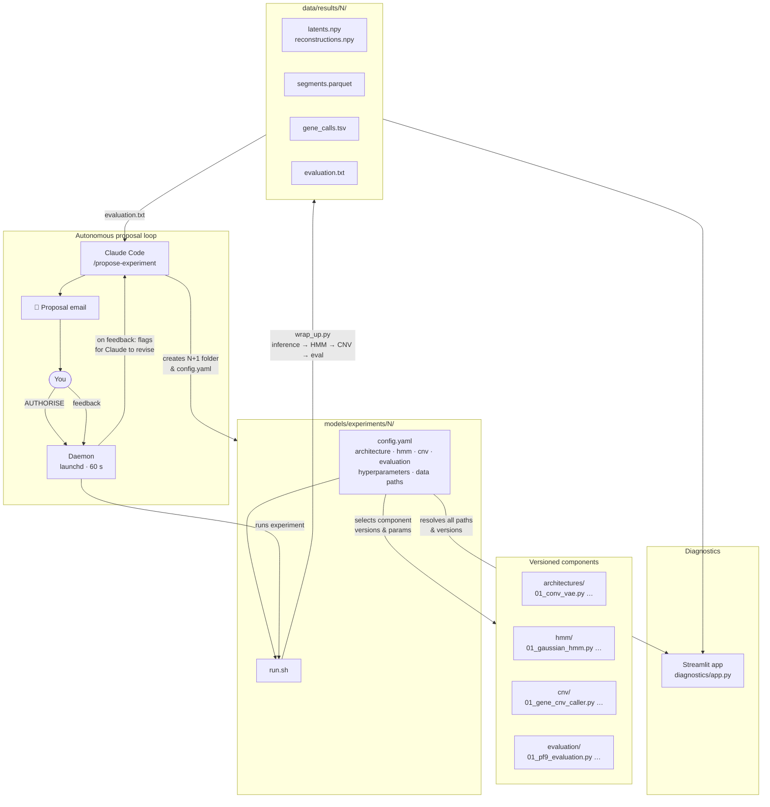

# AI autoresearch for copy number variation (CNV) discovery in malaria field samples using variational autoencoders

In March, Karpathy (legendary AI researcher) released [autoresearch](https://github.com/karpathy/autoresearch), where an AI agent continuously proposes and performs 5-minute ML experiments to improve a mini LLM. The idea was that you can go to sleep and by the time you wake up, your ML model has already explored 100 different architectures/hyperparameters/datasets without you having to constantly decide for yourself. Does this "autoresearch" strategy translate to complex biological problems? 

Malaria kills 600,000 people a year. Amplifications of certain genes in malaria have already made some drugs be dropped from the first-line treatment regimen in multiple countries. I'll talk through how I'm debating with AIs over email and getting my Mac mini to work for me as close to 24/7 as possible, to discover novel CNVs by "autoresearching" a variational autoencoder-based pipeline on WGS data. 


## Layout

```
data/
  inputs/       read-count NPY stores
  results/      per-experiment outputs (one folder per experiment)
  setup/        scripts to extract read counts from BAMs/CRAMs

assets/         sample manifests, BAM/CRAM path lists, reference files

models/
  train.py          entry point — runs a full experiment from a config
  architectures/    versioned VAE definitions  (01_conv_vae.py, …)
  hmm/              versioned HMM segmenters   (01_gaussian_hmm.py, …)
  cnv/              versioned CNV callers       (01_gene_cnv_caller.py, …)
  evaluation/       versioned evaluators        (01_pf9_evaluation.py, …)
  training/         dataset loader, trainer, inference (non-versioned)
  experiments/      one self-contained folder per experiment

diagnostics/    Streamlit app for interactive sample inspection
```

## Running an experiment

```bash
cd models/experiments/01
bash run.sh
```

Or directly:
```bash
.venv/bin/python models/train.py models/experiments/01/config.yaml
```

## Adding a new experiment

```bash
cp -r models/experiments/01 models/experiments/02
# edit models/experiments/02/config.yaml
```

A new experiment can reuse any existing versioned component — just point `architecture`, `hmm`, `cnv`, and `evaluation` in `config.yaml` at the same numbered files and adjust the parameters. Only create a new versioned file (e.g. `02_gaussian_hmm.py`) when the algorithm itself changes, not just the parameters.

Outputs are written to the `out_dir` defined in the config: `checkpoint.pth`, `latents.npy`, `reconstructions.npy`, `sample_ids.npy`, `segments.parquet`, `gene_calls.tsv`, `evaluation.txt`.

## How it works



## Experiment proposal workflow

Claude analyses the latest `evaluation.txt`, proposes the next experiment, creates the folder, and emails a summary. Reply "AUTHORISE" to run it on the Mac mini; reply with feedback to get a revised proposal.

**First-time setup** (install the background polling daemon):
```bash
bash tools/install_daemon.sh
```

**To propose the next experiment** (invoke from Claude Code):
```
/propose-experiment
```
Claude sets up the experiment folder, writes a README, and emails a ≤100-line summary.

**The daemon** (`tools/check_and_run.sh`, running via launchd every 60 s) checks for a reply:
- `AUTHORISE` → runs the experiment automatically
- Anything else → flags that feedback is waiting; open Claude Code and run `/check-reply`

**Privacy:** `check_reply.py` searches only by the exact Message-ID of the proposal email. It never lists or reads any other email. Reply body content is never written to disk or logs.

**VSCode vs Desktop:** Either works. The daemon runs independently of which editor is open.

## Diagnostics

```bash
cd diagnostics
streamlit run app.py
```

Select an experiment from the dropdown — the app loads that experiment's config to resolve data paths, component versions, and all calling parameters automatically.

## Setup

See [data/setup/](data/setup/) for scripts that extract read counts from BAMs/CRAMs and convert to NPY.
